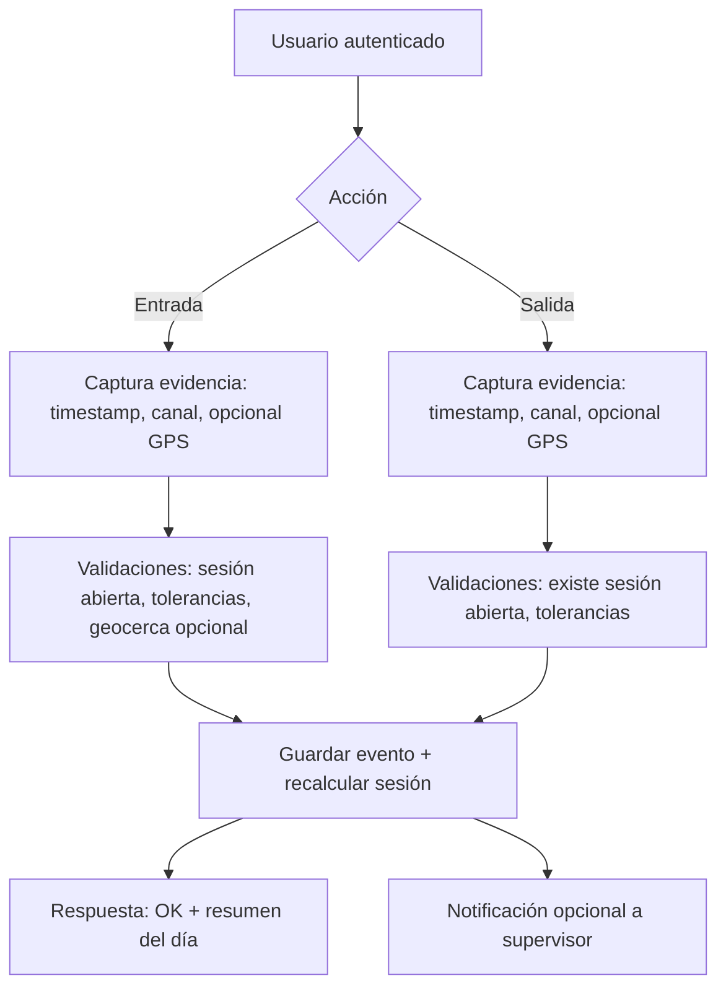
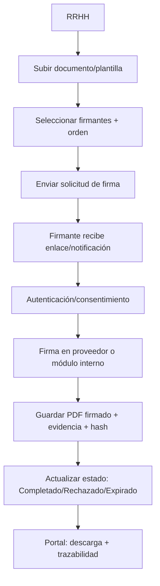

# MVP de Recursos Humanos con Asistencia, Administración y RRHH

## Resumen ejecutivo
Este informe define un **MVP (Producto Mínimo Viable) completo** para una web de RR.HH. con tres módulos: **Asistencia** (marcaje entrada/salida + historial), **Administración** (usuarios, turnos y reportes) y **RRHH** (firma digital + portal del colaborador). La propuesta prioriza **trazabilidad/auditoría**, **seguridad por diseño** y **capacidad de integración** (SSO/LDAP, nómina, biometría, geolocalización, notificaciones y almacenamiento documental). Como el **país no fue especificado**, el diseño legal se basa en criterios internacionales y marcos de referencia ampliamente adoptados, que deben aterrizarse a normativa local (laboral, protección de datos, firma electrónica). citeturn4search0turn9view0turn8view0

Decisiones clave: implementar autenticación moderna con **OpenID Connect sobre OAuth 2.0** (SSO/IdP) citeturn0search3turn0search2, soportar entornos corporativos con **SAML 2.0** citeturn1search9, y preparar aprovisionamiento/alta-baja-movimiento con **SCIM** citeturn1search2turn1search3. Para firma, se recomienda compatibilidad con estándares como **PAdES (ETSI EN 319 142-1)** para PDFs firmados citeturn3search3, y gobernanza de datos alineada a buenas prácticas (p. ej. OWASP ASVS/Top 10) citeturn2search0turn2search1 y transporte seguro con **TLS 1.3**. citeturn3search1

## Funcionalidades por módulo y comparativo
Criterio de prioridad: **Obligatoria (MVP)** = “sin esto no hay producto”, **Recomendada** = “sube el valor/controles y reduce fraude”, **Opcional** = “optimización o integración avanzada”. Dependencias se indican para planificar fases.

### Asistencia (marcaje y trazabilidad)
| Funcionalidad | Descripción | Prioridad | Dependencias |
|---|---|---|---|
| Marcaje entrada/salida | Registro de eventos con timestamp servidor, usuario, canal (web/móvil/kiosko) | Obligatoria | Auth + RBAC |
| Prevención de duplicados | No permitir “entrada” si hay sesión abierta; reglas configurables (tolerancias) | Obligatoria | Modelo “sesión” o motor de reglas |
| Historial personal | Vista por rango, filtros, export personal (PDF/CSV) | Obligatoria | Eventos + permisos |
| Geolocalización en marcaje | Captura de ubicación con consentimiento; evidencia para trabajo remoto/campo | Recomendada | UI permisos + API; política privacidad citeturn12search0turn12search12 |
| Geocercas (geofencing) | Validar marcaje dentro de radios/zonas permitidas | Recomendada | Geolocalización + catálogo sedes |
| Modo offline | Cola local firmada; sincroniza al reconectar | Opcional | App móvil/PWA |
| Integración biométrica | Kiosko o dispositivos (huella/rostro) para marcaje | Opcional (alto impacto legal) | Proveedor biométrico + DPIA + base legal; datos biométricos suelen ser “categoría especial” citeturn8view0 |

### Administración (usuarios, turnos, reportes)
| Funcionalidad | Descripción | Prioridad | Dependencias |
|---|---|---|---|
| Gestión de usuarios y roles | CRUD usuarios, roles, permisos; suspensión/terminación | Obligatoria | RBAC + auditoría |
| Turnos (definición) | Plantillas: hora inicio/fin, colación, tolerancias, nocturnidad | Obligatoria | Catálogo turnos |
| Asignación de turnos | Asignación por persona/área y vigencia; calendario | Obligatoria | Usuarios + turnos |
| Reportes estándar | Asistencia diaria, atrasos, ausencias, horas extra estimadas | Recomendada | Motor de cálculo |
| Exportación a nómina | Archivo/API con “periodos” y reglas (redondeo) | Recomendada | Mapeo a payroll |
| Auditoría administrativa | Registro inmutable de cambios críticos (turnos, permisos, reglas) | Recomendada | Audit log + retención (según país) |
| Aprovisionamiento SSO/SCIM | Alta/baja automatizada desde IdP (p. ej., Azure AD/Okta) | Opcional | SCIM citeturn1search2turn1search3 / OIDC citeturn0search3 |

### RRHH (firma digital y portal del colaborador)
| Funcionalidad | Descripción | Prioridad | Dependencias |
|---|---|---|---|
| Portal del colaborador | Perfil, horario asignado, historial asistencia, documentos | Obligatoria | Auth + permisos + storage |
| Bandeja de “pendientes” | Acciones: firmar doc, actualizar datos, descargar comprobantes | Obligatoria | Workflow |
| Firma digital integrada | Enviar/firmar/estado; evidencia (audit trail) | Recomendada | Proveedor firma + repositorio |
| Plantillas + versionado | Contratos/anexos; versionado + trazabilidad | Recomendada | Storage + metadatos |
| Firma en PDF con estándares | Preferir PDF firmado tipo PAdES (cuando aplique) citeturn3search3 | Opcional | Motor firma / proveedor |
| Múltiples firmantes y orden | Secuencial/paralela, recordatorios | Opcional | Motor workflow + notificaciones |

**Nota legal transversal (país no especificado):** en marcos como eIDAS, la “firma electrónica” se define ampliamente; la “cualificada” puede equivaler a manuscrita en su ámbito. citeturn6view0turn9view0

## Requisitos y flujos clave
**Requisitos funcionales (RF)**
El sistema debe autenticar usuarios vía **OIDC/OAuth2** (y opcionalmente SAML para SSO corporativo), administrar sesiones y roles, y registrar marcajes con integridad y no repudio operacional. citeturn0search3turn0search2turn1search9 Debe permitir modelar turnos y asignaciones, generar reportes, y exponer una API para integraciones (nómina, biometría, notificaciones). En RRHH, debe gestionar documentos (subida, metadata, versionado) y orquestar firma electrónica con estados. Para soporte de HR escalable, se recomienda contemplar SCIM para ciclo de vida de usuarios si el IdP lo soporta. citeturn1search2turn1search3

**Requisitos no funcionales (RNF)**
Seguridad: cumplir controles de verificación tipo **OWASP ASVS** (autenticación, sesiones, control de acceso, validaciones, logging seguro) citeturn2search0 y mitigar riesgos comunes alineados a **OWASP Top 10 (2021)**. citeturn2search1 Transporte cifrado con **TLS 1.3**. citeturn3search1 Privacidad: minimización de datos, consentimientos y base legal; si se usa biometría, tratarla como dato sensible en jurisdicciones tipo RGPD (biométricos para identificación unívoca se consideran “categoría especial”). citeturn8view0 Disponibilidad: objetivo MVP 99.5%+ con monitoreo; performance: P95 < 300 ms para marcaje (sin dependencias externas); auditabilidad: trazas completas.

### Diagramas de flujo


```mermaid
flowchart TD
A[Admin RRHH] --> B[Crear/editar turno]
B --> C[Definir reglas: inicio/fin, colación, tolerancias]
C --> D[Asignar turno a usuarios/área con vigencia]
D --> E[Generar calendario (semanal/mensual)]
E --> F{Cambios}
F -->|Cambio puntual| G[Override por fecha]
F -->|Cambio masivo| H[Reasignación por rango]
G --> I[Auditar cambio]
H --> I
I --> J[Publicar a portal colaborador]
```



```mermaid
flowchart TD
A[Colaborador] --> B[Inicio Portal]
B --> C[Ver: horario/turno]
B --> D[Ver: asistencia e incidencias]
B --> E[Documentos: pendientes de firma]
B --> F[Datos personales: solicitud de actualización]
E --> G[Firmar / Rechazar]
D --> H[Solicitar corrección (ticket)]
F --> I[Workflow aprobación RRHH]
```

## Arquitectura técnica propuesta
**Arquitectura recomendada para MVP: “monolito modular” + integraciones desacopladas.** Se separan dominios (Asistencia/Turnos/Documentos/Firma/Usuarios) dentro de un backend único para acelerar entrega, pero con límites claros para evolucionar a microservicios donde haga sentido (p. ej., Firma/Documentos). La autenticación se delega a un IdP compatible con **OIDC (sobre OAuth2)** citeturn0search3turn0search2 y opcionalmente **SAML 2.0** para corporativos. citeturn1search9

```mermaid
flowchart LR
U[Web/PWA/Móvil] -->|HTTPS TLS| FE[Frontend SPA/SSR]
FE -->|API REST| API[Backend (Módulos: Asistencia, Turnos, RRHH, Admin)]
API --> DB[(PostgreSQL)]
API --> OBJ[(Almacenamiento docs: S3/Azure Blob)]
API --> IDP[SSO/IdP OIDC/SAML]
API --> NOTIF[Notificaciones: Email/SMS/Push]
API --> SIGN[Proveedor Firma (API)]
API --> BIO[Biometría/Kiosko/Dispositivos]
API --> PAY[Payroll/Nómina (API o archivos)]
IDP --- LDAP[LDAP/AD]
```

**Frontend:** SPA/SSR (React/Vue/Angular) con RBAC en UI y componentes reutilizables.  
**Backend:** API REST con validaciones y “policy engine” para reglas de asistencia/turnos.  
**Base de datos:** relacional (PostgreSQL) para integridad y reportes.  
**Autenticación/SSO:** OIDC para login moderno citeturn0search3; OAuth2 como marco de autorización citeturn0search2; SAML 2.0 donde sea requisito corporativo citeturn1search9; LDAP para directorios (si aplica) citeturn1search0; SCIM para aprovisionamiento (opcional). citeturn1search2turn1search3  
**Geolocalización:** API del navegador requiere permiso explícito y es un dato sensible operacionalmente. citeturn12search0turn12search12  
**Almacenamiento documental:** objeto (p. ej., S3/Azure Blob) para PDFs y evidencias; Azure Blob está orientado a grandes volúmenes de datos no estructurados citeturn12search2; S3 se documenta como almacenamiento objeto escalable (elegir según nube). citeturn12search1  
**Firma digital:** preferir proveedor especializado; eIDAS define efectos legales (no discriminación por ser electrónica y equivalencia de firma cualificada) en su ámbito. citeturn9view0 Para PDF firmado, PAdES (ETSI) es referencia técnica. citeturn3search3  
**Seguridad y escalabilidad:** TLS 1.3 en tránsito citeturn3search1, controles OWASP ASVS citeturn2search0, y priorización de mitigaciones OWASP Top 10. citeturn2search1

## Prototipo mínimo viable
### Pantallas principales (MVP)
| Pantalla | Actor | Contenido mínimo |
|---|---|---|
| Login SSO | Todos | Botón SSO, fallback local (si aplica), recuperación |
| Dashboard colaborador | Colaborador | Resumen: “Hoy”, estado de marcaje, próximo turno, pendientes |
| Marcaje | Colaborador | Entrada/Salida, confirmación, GPS opcional, motivo (opcional) |
| Historial asistencia | Colaborador | Tabla por rango, incidencias, export personal |
| Portal documentos | Colaborador | Documentos disponibles, “pendientes de firma”, descarga |
| Admin usuarios/roles | Admin | CRUD usuarios, roles, estado, asignaciones |
| Admin turnos/calendario | Admin | Turnos, asignación, overrides por fecha |
| Reportes | Admin | KPIs básicos, export CSV, integración nómina (baja complejidad) |
| Gestión de firma | RRHH/Admin | Crear solicitud, estados, reenvíos, auditoría de firma |

### API endpoints (MVP) con payloads
| Endpoint | Método | Uso | Request (ejemplo) | Response (ejemplo) |
|---|---:|---|---|---|
| `/auth/session` | GET | Sesión actual (claims/roles) | — | `{ "userId":"u1","roles":["EMP"],"claims":{...}}` |
| `/attendance/check-in` | POST | Marcar entrada | `{ "channel":"web","geo":{"lat":-33.4,"lon":-70.6,"accuracyM":30},"deviceId":"d1" }` | `{ "status":"OK","eventId":"e1","openSessionId":"s1" }` |
| `/attendance/check-out` | POST | Marcar salida | `{ "channel":"web","geo":{...},"deviceId":"d1" }` | `{ "status":"OK","eventId":"e2","closedSessionId":"s1" }` |
| `/attendance/history` | GET | Historial personal | `?from=2026-02-01&to=2026-02-15` | `{ "items":[...], "summary":{...}}` |
| `/admin/users` | GET/POST | Listar/crear usuarios | `{ "email":"a@x.com","roles":["EMP"] }` | `{ "id":"u2" }` |
| `/admin/shifts` | GET/POST | CRUD turnos | `{ "name":"Turno A","start":"09:00","end":"18:00","breakMin":60 }` | `{ "id":"sh1" }` |
| `/admin/shift-assignments` | POST | Asignar turno | `{ "userId":"u1","shiftId":"sh1","validFrom":"2026-02-01" }` | `{ "id":"sa1" }` |
| `/reports/attendance` | GET | Reporte admin | `?period=2026-02` | `{ "rows":[...], "totals":{...}}` |
| `/documents` | POST | Subir doc | `multipart/form-data` + metadata | `{ "docId":"doc1","version":1 }` |
| `/signatures/requests` | POST | Crear solicitud firma | `{ "docId":"doc1","signers":[{"userId":"u1","order":1}] }` | `{ "sigReqId":"sr1","status":"SENT" }` |
| `/webhooks/signature` | POST | Callback proveedor | `{ "sigReqId":"sr1","status":"COMPLETED","artifactUrl":"..." }` | `200 OK` |

**Notas de diseño:**  
Se recomienda que el backend actúe como **orquestador**, y que el PDF firmado y evidencia (audit trail) queden almacenados en el repositorio documental; para PDF avanzado, PAdES es una referencia técnica común en ecosistemas eIDAS. citeturn3search3turn9view0

### Modelos de datos (tablas mínimas)
| Tabla | Campos clave | Observaciones |
|---|---|---|
| `users` | `id, email, name, status, external_id` | `external_id` para IdP/LDAP |
| `roles` | `id, code, name` | RBAC |
| `user_roles` | `user_id, role_id` | N..N |
| `shifts` | `id, name, start_time, end_time, break_min, rules_json` | reglas extensibles |
| `shift_assignments` | `id, user_id, shift_id, valid_from, valid_to, overridden_by` | historial de asignación |
| `attendance_events` | `id, user_id, type(IN/OUT), ts_server, channel, geo_lat, geo_lon, geo_acc_m, device_id` | evidencia; geo opcional |
| `attendance_sessions` | `id, user_id, in_event_id, out_event_id, worked_min, anomalies_json` | derivada/calculada |
| `documents` | `id, owner_area, category, created_by, created_at` | metadatos |
| `document_versions` | `id, document_id, version, storage_uri, sha256, created_at` | hash para integridad |
| `signature_requests` | `id, document_version_id, status, provider, created_at, completed_at` | workflow |
| `signature_signers` | `id, sig_req_id, user_id, order, status, signed_at` | orden y estado |
| `audit_log` | `id, actor_user_id, action, entity, entity_id, ts, diff_json` | auditoría admin |
| `notifications` | `id, user_id, type, payload_json, status, ts` | reintentos |

## Roadmap por fases con esfuerzo y criterios de aceptación
Estimación orientativa para un equipo pequeño (1 FE, 1 BE, 0.5 QA/PM). Ajustar a complejidad real, integraciones y compliance.

| Fase | Alcance | Esfuerzo (h/persona) | Duración típica | Criterios de aceptación |
|---|---|---:|---|---|
| F0 Base | Diseño UX, modelo datos, RBAC, auditoría base, CI/CD | 120–180 | 1–2 semanas | Login funcional; roles aplican en UI/API; logs de cambios críticos |
| F1 MVP Asistencia + Turnos | Marcaje IN/OUT, historial, turnos + asignación simple, dashboard | 300–420 | 3–4 semanas | Marcaje sin duplicados; historial por rango; turnos visibles en portal; export CSV básico |
| F2 Admin + Reportes + Nómina | Reportes, cierres por periodo, export nómina, notificaciones | 220–320 | 2–3 semanas | Reporte mensual consistente; export validado por nómina (prueba de importación); auditoría completa de ajustes |
| F3 RRHH Firma + Documentos | Repositorio docs, solicitud firma, estados, webhook proveedor | 260–380 | 2–3 semanas | Crear solicitud; firmante completa; PDF firmado almacenado + hash; trazabilidad end-to-end |
| F4 Mejoras | Geocercas, SCIM, biometría/kiosko, offline | 240–500 | 2–5 semanas | Cumple política de privacidad; pruebas antifraude; integraciones estables |

**Puntos críticos de aceptación (ejemplos):**  
Marcaje: respuesta < 2 s en condiciones normales; si geolocalización está habilitada, debe solicitar permiso y fallar con mensaje claro si no hay consentimiento. citeturn12search0turn12search12  
Firma: el sistema no debe rechazar evidencia solo por ser electrónica en escenarios donde aplique el principio de no discriminación; si se requiere equivalencia fuerte, debe habilitar “firma cualificada” donde exista. citeturn9view0  

## Herramientas, librerías y servicios recomendados
**Identidad y acceso**
OIDC (Core) define autenticación sobre OAuth 2.0 y uso de claims; adoptarlo facilita SSO moderno. citeturn0search3turn0search2 Para entornos enterprise heredados, SAML 2.0 es estándar de aserciones/autenticación y se usa ampliamente para SSO. citeturn1search9 Para provisión de identidades, SCIM estandariza esquema y protocolo sobre HTTP. citeturn1search2turn1search3 LDAP es base frecuente en directorios corporativos. citeturn1search0

**Seguridad**
OWASP ASVS proporciona un marco de requisitos de seguridad verificables para apps modernas. citeturn2search0 OWASP Top 10 guía riesgos comunes a priorizar (inyección, control de acceso roto, etc.). citeturn2search1 TLS 1.3 previene espionaje/manipulación en tránsito (base para HTTPS robusto). citeturn3search1

**Geolocalización y notificaciones**
La Geolocation API del W3C estandariza acceso a ubicación y requiere permiso del usuario; úsese con transparencia y minimización. citeturn12search0turn12search12 Para push, Firebase Cloud Messaging es una opción cross-platform documentada oficialmente. citeturn12search3

### Proveedores de firma digital (ejemplos con docs oficiales)
DocuSign documenta su **eSignature REST API** como API principal de integración. citeturn10search0turn10search16 Adobe ofrece **Acrobat Sign API** para flujos de firma embebida. citeturn10search1turn10search5 En ecosistema hispanohablante, **Signaturit** y **Viafirma** publican documentación/API en español para integración. citeturn10search2turn10search10turn10search3turn10search19  
Para formatos, una referencia pública y didáctica en español sobre CAdES/XAdES/PAdES puede consultarse en portales gubernamentales especializados. citeturn10search15  
En regulaciones tipo eIDAS, se definen firma electrónica/avanzada/cualificada y sus efectos. citeturn6view0turn9view0

### Proveedores/tecnologías biométricas (ejemplos)
ZKTeco publica SDKs para integración biométrica (huella/rostro) usados también en **time & attendance**. citeturn11search0 Suprema expone BioStar 2 API (JSON) para operaciones de control/usuarios/eventos. citeturn11search1 HID describe portafolio de tecnologías biométricas de autenticación. citeturn11search2 Facephi dispone de documentación para plataforma de verificación biométrica. citeturn11search3  
**Advertencia de cumplimiento:** datos biométricos destinados a identificación unívoca pueden ser “categoría especial” en marcos como RGPD (tratamiento restringido). citeturn8view0

## Riesgos, mitigaciones y consideraciones legales
**País no especificado:** los requisitos exactos de marcaje laboral, conservación de registros, validez de firma electrónica y condiciones de biometría dependen de normativa local; se recomienda revisión legal previa al despliegue productivo.

Riesgo de privacidad: biometría y geolocalización elevan sensibilidad (perfilado, vigilancia). Mitigar con minimización, transparencia, controles de acceso, retención limitada y base legal; en RGPD, biométricos para identificación unívoca están prohibidos salvo excepciones. citeturn8view0turn12search12  
Riesgo de validez probatoria: firma simple puede no bastar para ciertos actos; mitigar soportando distintos niveles de firma según jurisdicción y evidencias completas. En eIDAS, una firma no debe perder admisibilidad solo por ser electrónica, y la firma cualificada equivale a manuscrita (en su ámbito). citeturn9view0  
Riesgo de seguridad: exposición de datos de RR.HH. (PII) y movimientos (asistencia) requiere controles; mitigar alineando verificación con ASVS y priorizando OWASP Top 10; asegurar transporte con TLS 1.3. citeturn2search0turn2search1turn3search1  
Riesgo de integraciones: fallas de proveedor (firma/push) bloquean procesos; mitigar con colas/reintentos, estados idempotentes, webhooks verificados, y degradación elegante.

## KPIs y métricas de éxito
Operación: % marcajes exitosos, tasa de duplicados/rechazos, correcciones por RR.HH. por 100 colaboradores, puntualidad (llegadas a tiempo), latencia P95 de `/attendance/*`, error rate, disponibilidad.  
RRHH/Firma: tiempo medio de ciclo de firma (envío→completado), % documentos completados en 24/48h, tasa de rechazo, reintentos por firmante.  
Adopción: % usuarios activos semanales (WAU/MAU), % uso del portal (descarga docs, consultas de historial), NPS interno.  
Cumplimiento: % cambios admin con audit log completo, % solicitudes de datos atendidas a tiempo, incidentes de acceso indebido.

## Referencias y fuentes prioritarias
OAuth 2.0 (RFC 6749) y OpenID Connect Core definen base de autorización/autenticación para SSO moderno. citeturn0search2turn0search3  
SAML 2.0 (OASIS) es estándar de aserciones y protocolos para SSO entre dominios. citeturn1search9  
SCIM (RFC 7643/7644) estandariza provisión de identidades sobre HTTP. citeturn1search2turn1search3  
eIDAS (UE 910/2014) define firma electrónica (incl. avanzada/cualificada) y efectos legales (no discriminación; equivalencia de firma cualificada). citeturn6view0turn9view0  
Ley Modelo CNUDMI/UNCITRAL sobre Firmas Electrónicas (2001) como referencia internacional de equivalencia funcional y criterios de fiabilidad. citeturn4search0turn4search1  
ETSI EN 319 142-1 (PAdES) para firmas avanzadas en PDF. citeturn3search3  
RGPD (UE 2016/679) Art. 9: biométricos para identificación unívoca como categoría especial de datos. citeturn8view0  
OWASP ASVS y OWASP Top 10: marcos de verificación y priorización de riesgos de seguridad. citeturn2search0turn2search1  
TLS 1.3 (RFC 8446) para canal seguro en HTTPS. citeturn3search1  
W3C Geolocation API y documentación técnica (permiso/privacidad). citeturn12search0turn12search12  
APIs oficiales de firma: DocuSign, Acrobat Sign, y proveedores con documentación en español como Signaturit y Viafirma. citeturn10search0turn10search1turn10search10turn10search19